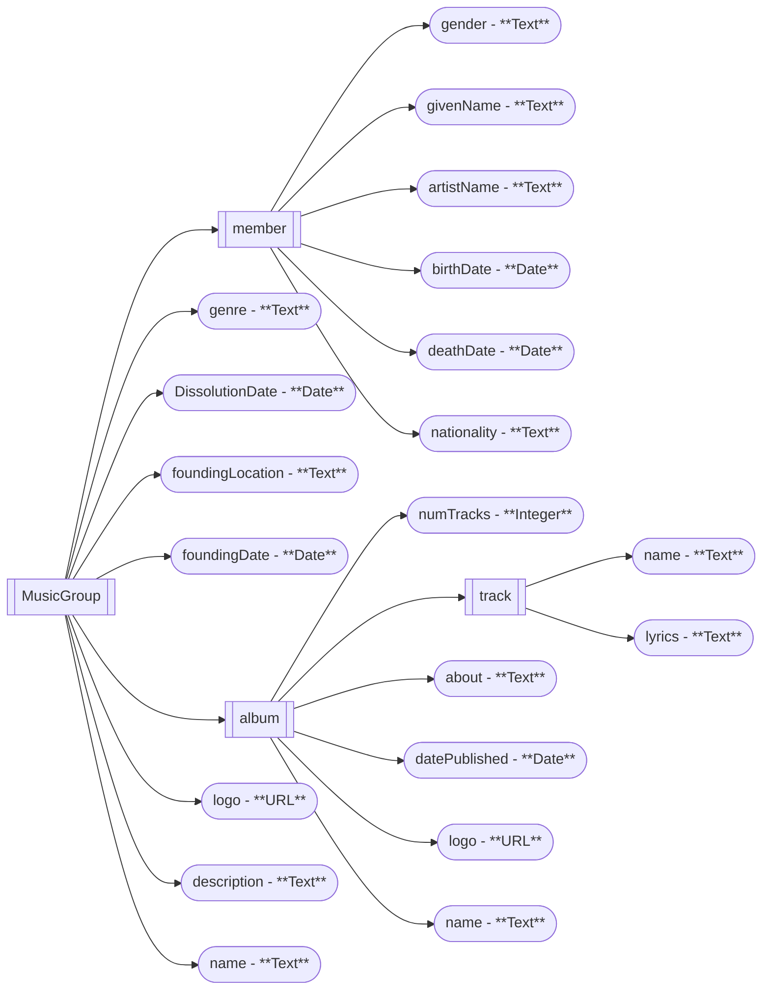

# Apollo's-Orchestra


# Running

from the `apollo-site/django/` directory, run the following commands:

```bash
pipenv install django
pipenv run pipenv install
pipenv run python manage.py runserver
```

It will start the server at `http:///127.0.0.1::8000/`

# Ontology

We used the following ontology to represent the data:

*psa: a mermaid plugin for markdown is needed to be able to render the following graph*


