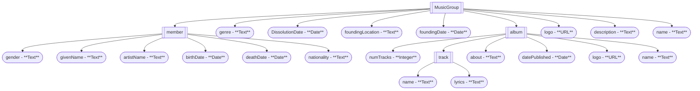

```mermaid
graph TD
    MusicGroup[[MusicGroup]] --> album[[album]]
    MusicGroup --> genre([genre - **Text**])
    MusicGroup --> DissolutionDate([DissolutionDate - **Date**])
    MusicGroup --> foundingLocation([foundingLocation - **Text**])
    MusicGroup --> foundingDate([foundingDate - **Date**])
    MusicGroup --> member[[member]]
    MusicGroup --> group_logo([logo - **URL**])
    MusicGroup --> group_about([description - **Text**])
    MusicGroup --> groupName([name - **Text**])

    member --> gender([gender - **Text**])
    member --> givenName([givenName - **Text**])
    member --> artistName([artistName - **Text**])
    member --> birthDate([birthDate - **Date**])
    member --> deathDate([deathDate - **Date**])
    member --> nationality([nationality - **Text**])

    album --> numTracks([numTracks - **Integer**])
    album --> track[[track]]
    album --> albumAbout([about - **Text**])
    album --> datePublished([datePublished - **Date**])
    album --> albumLogo([logo - **URL**])
    album --> albumName([name - **Text**])

    track --> trackName([name - **Text**])
    track --> lyrics([lyrics - **Text**])
```