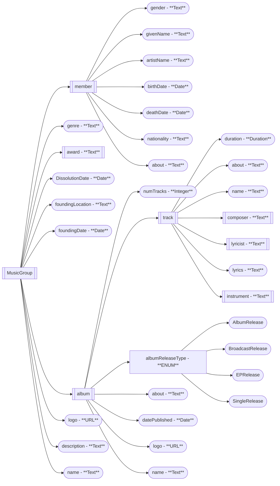

Thing->CreativeWork
    ->  MusicPlaylist -> MusicAlbum
    ->  MusicPlaylist -> MusicRelease
    -> Organization -> PerformingGroup -> Music Group
    -> MusicRecording

Thing->Person

MusicAlbum
MusicGroup or Person
MusicRecording
MusicAlbumReleaseType ENUM(AlbumRelease, BroadcastRelease, EPRelease, SingleRelease)

"""
sugestão da prof: começar com o ([MusicGroup])(https://schema.org/MusicGroup) que é o mais genérico e depois ir para os mais específicos, à medida que for necessário

Se pensarmos nisto como uma arvore, o MusicGroup seria o nó raiz e os outros seriam os nós filhos
"""

